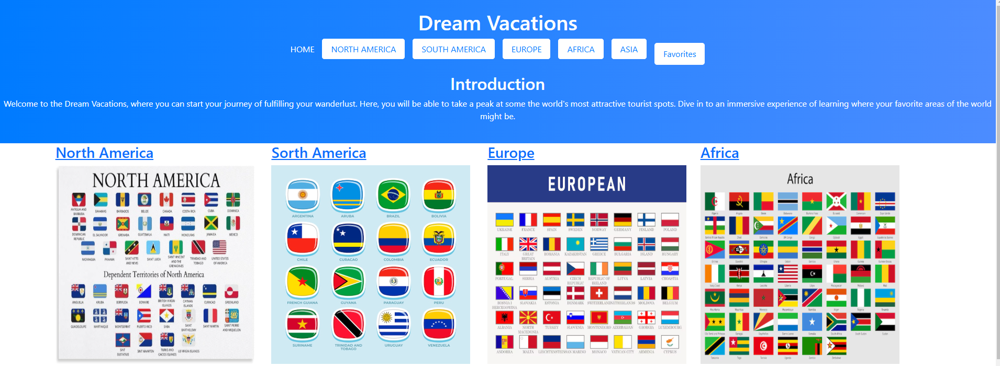
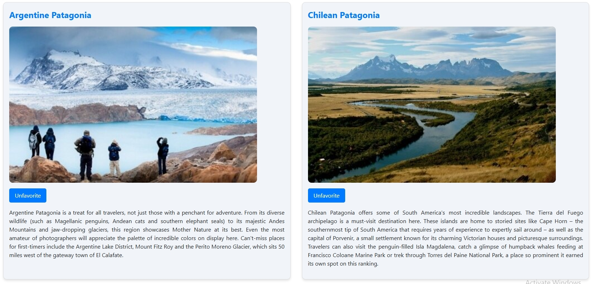
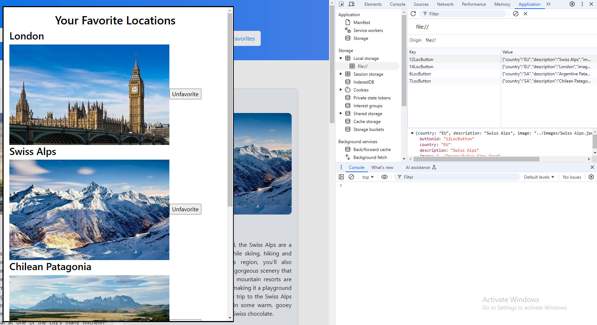

<!-- PROJECT LOGO -->
 

  <h3 align="center">Dream Vacations</h3>

  

    A informational and easy to use site for vacationers

<!-- ABOUT THE PROJECT -->
## About The Project

This website allows the user to click to other continent webpages using text or image links. 

They will also be able to favorite places from those continent webpages and put them in their favorites list using local storage. 
Users can bring up their favorites in a modal by clicking the "Favorites" button in the navbar.

When the user clicks a location's image a video will pop up in a modal describing the respective place. 

(<a href="#readme-top">back to top</a>)

### Built With

* Visual Studio Code
* HTML
* Javascript
* CSS
* Bootstrap

(<a href="#readme-top">back to top</a>)

<!-- CONTACT -->
## Group members

<li>Xavier Vang 
<li>Anthony Giannetti
<li>Zach Taylor
<li>Guy Terry

Project Link: [https://github.com/XYVang/projectOne](https://github.com/XYVang/projectOne)

Deployed Application: [https://xyvang.github.io/projectOne/](https://xyvang.github.io/projectOne/)

(<a href="#readme-top">back to top</a>)

<!-- ACKNOWLEDGMENTS -->
## Acknowledgments

Resources we found the were helpful and would like to give credit to

* [Readme Template] https://github.com/othneildrew/Best-README-Template/blob/main/README.md

(<a href="#readme-top">back to top</a>)
